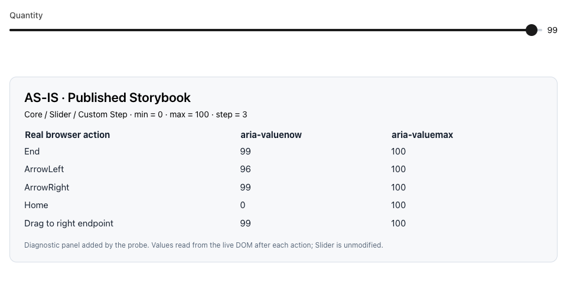
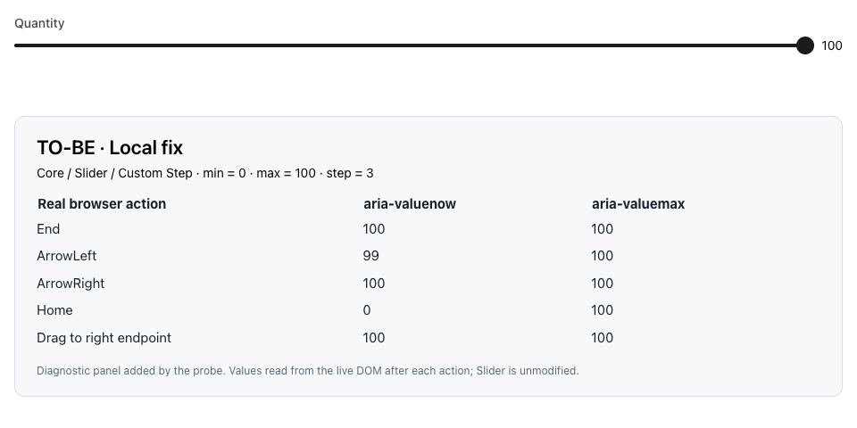

# Slider off-grid endpoint evidence

## Reproduction

Open [the published Custom Step story](https://facebook.github.io/astryx/storybook/?path=/story/core-slider--custom-step&args=step:3). It uses `min=0`, `max=100`, `step=3`.

1. Focus the thumb and press End: the published version reports 99 despite `aria-valuemax=100`.
2. Drag the thumb to the right endpoint: it still reports 99.
3. Run the same story on the fixed branch: both actions reach 100; Left then Right visits 99 then 100.

The before/after screenshots and recordings use real Playwright keyboard and mouse actions in Chrome 153.0.8010.50, with a 960×480 viewport. The diagnostic panel is injected by the probe, not part of Slider. Every table entry is read from the live DOM after its action. The published deployment is not asserted to be the exact base commit; the separate regression probe below isolates the source change against an exact commit.

| Before: published Storybook | After: fixed local source |
| --- | --- |
|  |  |

Recordings: [before](before.mp4), [after](after.mp4). Machine-readable observations: [browser-results.json](browser-results.json).

## Regression sensitivity

Fix commit: `b46a9c0ec8fcb049bc2866d62204c8fc6ebae56f`. Base: `f138ed997b88e4dc4361e73b388bd4b1d8a47bf4`.

`source-sha256.json` records the three source files used for capture and tests; their hashes were verified unchanged after the commit hooks. `fix.patch` contains only those three PR files.

The new test file is held constant while a temporary Vite load hook substitutes **only** `Slider.tsx`:

- Original Slider source: **3 failed, 65 passed**. All three new tests receive 99 where 100 is expected.
- Fixed endpoint selection with the old `currentValue ± step` arrow calculation restored: **2 failed, 66 passed**. The keyboard checks receive 96 where 99 is expected. The pointer regression still passes.
- Full fix: **68 passed**.

Logs: [original source](baseline-regression.log), [old-arrow mutation](arrow-mutation.log), [full fix](focused-tests.log).

No live source file was swapped during these probes. The same local Storybook kept running the fix.

## Repeating the probes

From the fixed repository with dependencies installed:

1. Download `vitest.slider-baseline.config.mts` into the repository root.
2. Run `pnpm exec vitest run --config vitest.slider-baseline.config.mts packages/core/src/Slider/Slider.test.tsx` (expected failure on the original source).
3. Run `SLIDER_PROBE=previous-arrow-stepping pnpm exec vitest run --config vitest.slider-baseline.config.mts packages/core/src/Slider/Slider.test.tsx` (expected failure on the arrow-only mutation).
4. Run `pnpm exec vitest run packages/core/src/Slider/Slider.test.tsx` (expected pass).
5. Remove the temporary configuration file.

For browser capture, download `browser-proof.cjs` into the repository root, start Storybook on port 6007, and run `node browser-proof.cjs`. It requires Playwright, an installed Chrome browser, and Playwright's video encoder. Output defaults to `slider-evidence/`, overridable with `SLIDER_EVIDENCE_DIR`.

## Representative unchanged keyboard paths

The browser probe checks these on both builds:

| Configuration | End | Then ArrowLeft |
| --- | --- | --- |
| min=0, max=100, step=10 | 100 | 90 |
| min=0, max=100, step=6 | 100 | 96 |
| min=1, max=100, step=3 | 100 | 97 |
| min=-1, max=100, step=3 | 100 | 98 |

The step=6 case is important: the old implementation already allowed an off-grid explicit maximum when rounding overshot it and clamping brought it back. The fix makes that endpoint consistently reachable, rather than depending on which side of a rounding threshold it falls on.

These are scoped DOM/interaction checks, not a full assistive-technology or browser-engine audit. Screenshots are a published-versus-local comparison, not a claim of pixel-identical builds.
